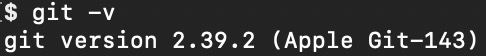

# :wave: The Basics of GitHub

Introduction to git concepts and basics

## Install Git

Download for [Windows](https://git-scm.com/downloads/win) or [macOS](https://git-scm.com/downloads/mac)

If you are using macOS, you can also just open `terminal` and type in the `git -v` command and `Xcode` will launch and install the git package automatically on newer OS.

To verify git is properly installed, open `command line` on Windows or `terminal` on macOS and type the following command:

```git -v```

and you should see the current version of git if properly installed.



## Github Education

To get the most out of git, [signup](https://github.com/signup) for a github account and get [Github Education access](https://github.com/education/students).

## Using Git in VS Code

Once have git installed and you have set up a github account, we can now get started with Git in VS Code!

[Using Git source control in VS Code](https://code.visualstudio.com/docs/sourcecontrol/overview)

[Introduction to Git in VS Code](https://code.visualstudio.com/docs/sourcecontrol/intro-to-git)

[Working with GitHub in VS Code](https://code.visualstudio.com/docs/sourcecontrol/github)

[](https://youtu.be/i_23KUAEtUM)

You can also watch [Using Git with Visual Studio Code (Official Beginner Tutorial)](https://youtu.be/i_23KUAEtUM) on youtube.

## Official Guide to Github

### [:eyes: View official Guide for Git and GitHub :eyes:](/GITHUB.md)

## For Multimedia courses

We recommend you to set up submodules of the course repos in a `demos` folder inside your `root`'s `public_html` folder. To do so, use the following commands:

### Setting up a submodule inside your root

```shell
git submodule add <url> <local-name>
```

For example, if you are cloning a copy of `web4` into `public_html/demos/web4`

```shell
git submodule add https://github.com/582Multimedia/582-403-va-web4-db-cms.git public_html/demos/web4
```

### update all submodules inside your root

```shell
git submodule update --init --recursive
```

## Additional Tools

[Sourcetree](https://www.sourcetreeapp.com/)

[GUI Clients list](https://git-scm.com/downloads/guis)
